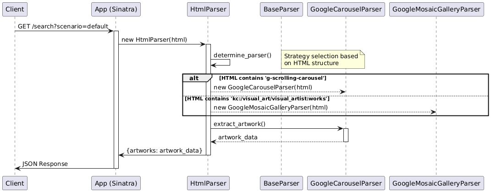
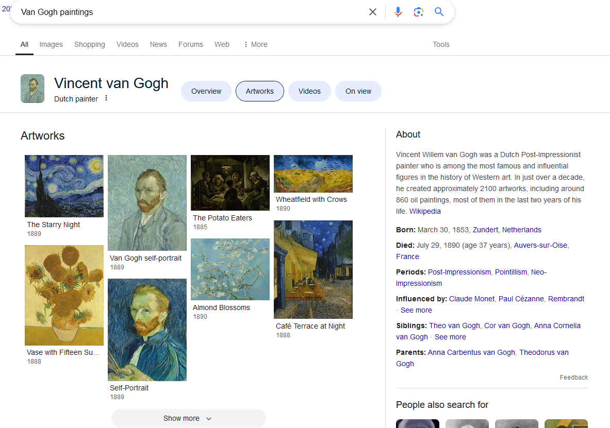
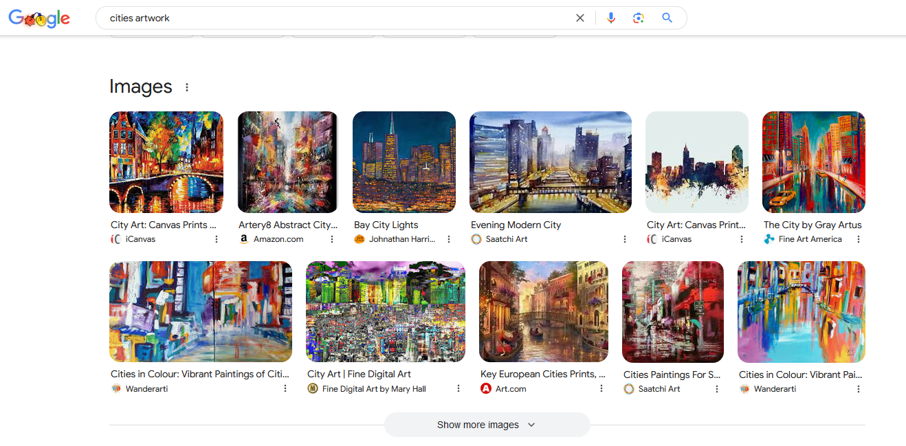

# Running the app

The application offers a simple API that can be accessed via the Swagger UI for testing.

In order to run the app, run the following commands:

```sh
bundle install
ruby app.rb
```

The app will be available at `http://localhost:4567/` showing a Swagger UI.

Tests can be run with `rspec` from the root of the project:

```sh
bundle exec rspec
```

The single method with the three variations in the API can be executed with the following command:

Scenario provided with the exercise:

```sh
curl -X GET "http://localhost:4567/search"
```

Scenario with a different structure:

Van Gogh artwork:

```sh
curl -X GET "http://localhost:4567/search?scenario=van_gogh"
```

Leonardo da Vinci artwork:

```sh
curl -X GET "http://localhost:4567/search?scenario=leonardo_da_vinci"
```

*There are PlantUML diagrams in the `docs` folder. It is necessary to install PlantUML if you want to re-render them. The installation procedure is beyong the scope of this README.*

# Architecture

Given the different structures returned by Google (more on this in the Code comments section below), I decided to implement a strategy pattern to handle the different parsing strategies. This is demonstrated in the `docs/sequence.puml` file that can be seen in the image below:



# Code comments

- It took me about 50 minutes to write the code that handles the parsing of the provided HTML. However, in the first attempt I was reading the image source attribute from the `` tag. Upon viewing the expected results, I noticed that the image source wasn't matching the expected results because the value the browser was rendering was dynamically generated based on javascript sent to the browser.
    - So I spent probably more than I should have (30 minutes?) parsing the Javascript so I could extract the images so they correctly matched the expected results.
    - Commit Id `aea590383c3ef7e494ff526fae0e2191f391ddfe` has this milestone
- In about 1h30m I was finished with the scenario provided so I moved on to executing other searches in Google and covering at least one more scenario. The scenario I covered uses pretty much the same query (Van Gogh artwork) but the current results from Google are displayed in a different structure, a mosaic gallery (see image below).
    - In my alternative scenario, the image source was extracted directly from the  tag



- I used the strategy pattern to handle the different structures that Google provides and I tested it with another query (Leonardo da Vinci artwork) and it worked as expected. All scenarios can be seen in the Swagger UI and are in `spec/fixtures/` folder.
    - This new scenario (different structure) took me about 1h30m minutes to implement.
- Adding the Swagger UI, writing these notes, and sending the PR took me probably another 1 hour for a total of ~4 hours.

## Problems and improvements

- Exceptions are not handled
- There is no logging
- The sinatra setup is very simple and is only meant to offer a different way to test the code
- When there are no `extensions` in the expected results, the value returned is `null`, but I kept it as an empty array
- Google base URL used in the absolute image returned by the API is hardcoded and should be dynamic based on the base URL for the request
- The parsing code is somewhat flaky and needs to be improved for production usage
    - It doesn't account for potential empty strings in the HTML being parsed
    - It could probably be optimized for performance when parsing the HTML. I used Nokogiri, but other strategies (text parsing?) could be used to improve performance
    - I couldn't find any clear ways to identify the gallery elements in the HTML for the Mosaic scenario so I had to rely on "pattern matching" traversing the HTML children until I found the pattern I wanted
        - There are probably other ways to optimize this if enough time is spent looking at the different HTML structures returned by Google
- I attempted to add another scenario, which was different from the one provided in the exercise, and the one that I added, but didn't move forward as it gave me yet another different structure in Google search results (query: "cities artwork") that would required yet another different parsing strategy or more investigation into the HTML structure returned by Google to look for a pattern that would match all queries.


